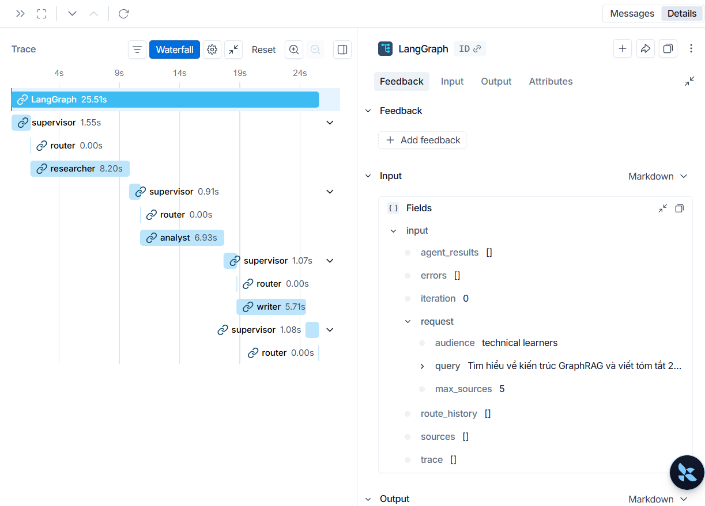

# Benchmark Report

This report compares the Single-Agent Baseline with the Multi-Agent Workflow.

| Run | Latency (s) | Cost (USD) | Quality | Notes |
|---|---:|---:|---:|---|
| Single-Agent Baseline | 4.54 | 0.0001 | 2.0 | Iterations: 1. Sources: 0. Errors: 0 |
| Multi-Agent Workflow | 18.72 | 0.0005 | 8.5 | Iterations: 5. Sources: 5. Errors: 0 |

## LangSmith Trace Screenshot

## Failure Mode & How to Fix

**Failure mode:** Hệ thống bị kẹt trong một vòng lặp vô tận (infinite loop) khi `Analyst` liên tục cho rằng `research_notes` chưa đủ chất lượng và yêu cầu `Supervisor` trả ngược lại cho `Researcher` đi tìm kiếm lại, nhưng dữ liệu tìm kiếm trả về không thay đổi. Điều này khiến cả 3 Agents cứ chuyền tay nhau liên tục làm tốn chi phí API và không bao giờ ra được kết quả cuối cùng.

**Cách fix:** Thiết lập giới hạn số vòng lặp tối đa (guardrail `max_iterations`). Khi đạt đến `state.iteration >= 5`, `Supervisor` sẽ có cơ chế bắt buộc phải chuyển hướng (route) sang trạng thái `done` hoặc `writer` để kết thúc chương trình. Đoạn code này đã được implement tại logic của `SupervisorAgent`.
